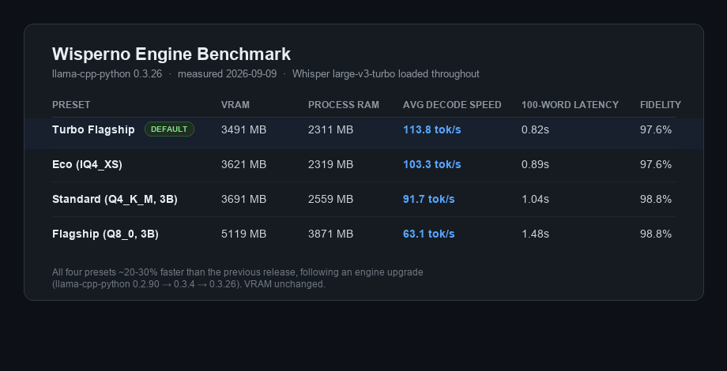

# Wisperno


**100% offline, GPU-accelerated push-to-talk dictation for Windows.**

Hold a hotkey, speak, release - Wisperno transcribes your voice locally
(`faster-whisper large-v3-turbo` on CUDA) and cleans it up with a local
quantized LLM before pasting the result into whichever app has focus. No
audio or text ever leaves the machine.

**Ships with Turbo Flagship as the default engine** - `Qwen2.5-1.5B-Instruct`
at ~114 tok/s decode, ~3.5GB combined VRAM with Whisper, and the fastest
measured latency of the four presets (see [BENCHMARKS.md](BENCHMARKS.md)).
Switch presets any time from Settings if you'd rather trade speed for the
Flagship tier's extra fidelity headroom.

## Core Features

- **Two dictation engines**: instant, zero-LLM Direct Dictation (rule-based
  formatting, sub-second latency) and on-demand LLM Polish for grammar/filler
  cleanup - pick per-trigger, not an all-or-nothing switch.
- **Live Transcription** (`Ctrl+Shift+L`): a separate streaming mode for
  meetings/lectures/calls - continuous Whisper transcription re-decoded every
  0.6s against the entire unconfirmed audio buffer (never a trailing slice -
  an earlier sliding-window design was found by testing to silently drop
  real content, and was replaced), shown in a floating overlay with Pause /
  Stop & Save / Discard. Measured **RTF ~0.074** (~13.5x faster than
  real-time) with no second model loaded - see
  [LIVE_TRANSCRIPTION_ARCHITECTURE.md](LIVE_TRANSCRIPTION_ARCHITECTURE.md)
  for the full pipeline, including the content-loss bug that shaped the
  current design.
- **Sub-second latency** end to end on the default Turbo Flagship preset.
- **100% private, fully offline** - no network calls once models are on disk.
- **Four engine presets** trading VRAM for fidelity/speed (measured, not
  estimated - see `tests/benchmark_models.py`):

  | Preset | VRAM | Decode speed | Notes |
  |---|---|---|---|
  | **Turbo Flagship (default)** | ~3.5 GB | ~114 tok/s | Fastest tier, instant text replacement |
  | Eco | ~3.6 GB | ~103 tok/s | Compact footprint, Standard-level fidelity |
  | Standard | ~3.7 GB | ~92 tok/s | Balanced, previous default |
  | Flagship | ~5.1 GB | ~63 tok/s | Q8_0 weights + fp16 KV-cache, highest fidelity |

- **Contextual transform modes**: Polish, Prompt Engineer, Bullet Points, Raw
  verbatim, plus a user-defined Transforms hub for custom prompts.
- **Vocabulary/dictionary** biasing for names and jargon Whisper wouldn't
  otherwise get right - ships empty by default; add your own via Settings ->
  Dictionary (the corrections used during development were personal to that
  environment and intentionally not included here).

## Default Hotkeys

| Hotkey | Action |
|---|---|
| `Ctrl+Alt` | Tap to toggle Direct Dictation (tap to start, tap to stop) |
| `Ctrl+Space` | Hold to talk (disabled by default - enable in Settings) |
| `Ctrl+Shift+L` | Start/stop a Live Transcription session |
| `Alt+C` (alias `Alt+P`) | Polish - the default transform |
| `Alt+X` | Prompt Engineer transform |
| `Alt+V` | Detailed Code Fix Prompt transform |
| `Ctrl+Shift+B` | Cycle active transformation mode |
| `Ctrl+,` | Open Settings & Dictionary |
| `Ctrl+Shift+H` | Toggle the dashboard window |

Any transform's own hotkey also polishes the current text selection if
nothing is spoken - a separate "Polish Selected Text" shortcut isn't needed.
Additional transforms get their own configurable shortcut from the
Transforms hub.

## What's New

Summarized from this build's own update notes, verified against source
where checkable (e.g. the hotkeys above are read from `src/database.py`/
`src/engine.py`, not copied from prose):

- **Inference engine upgrade**: `llama-cpp-python` `0.2.90 -> 0.3.26`,
  every preset decoding ~20-30% faster (Turbo Flagship: 89.3 -> 113.8 tok/s)
  with unchanged VRAM and fidelity. See [BENCHMARKS.md](BENCHMARKS.md).
- **Optional audio cues** (`src/audio_cues.py`): a short tone on
  dictation start/stop via `winsound.Beep()` - stdlib, no new dependency,
  off by default, toggle in Settings -> General.
- **Real-Time Streaming Live Transcription** - a whole new mode (`Ctrl+Shift+L`),
  separate from push-to-talk dictation. See the Core Features entry above
  and [LIVE_TRANSCRIPTION_ARCHITECTURE.md](LIVE_TRANSCRIPTION_ARCHITECTURE.md)
  for the full design, including a real content-loss bug found by its own
  test suite and fixed before shipping.
- **Wispr Flow parity improvements**: pause-based paragraph splitting (a
  1.3s+ mid-dictation pause starts a new paragraph, using Whisper's
  word-level timestamps - segment-level timestamps were tested and found
  unable to detect the pause at all), a zero-LLM rule formatter
  (`src/direct_formatter.py`) for pronoun capitalization/filler
  stripping/list detection in well under 10ms, and spoken command parsing
  ("slash compact" -> `/compact`). Vocabulary/dictionary biasing (Settings ->
  Dictionary) ships **empty by default** - it's a personal customization
  feature, not preloaded with any particular developer's own corrections.
- **UI redesign**: a jet-black/purple visual pass across the whole dashboard
  (`src/ui/theme.py` - `#08080C` canvas, `#A855F7` accent), a redesigned
  History tab (word/time/WPM/dictation-count summary row, search, filter
  pills), a Hardware Telemetry tab showing GPU VRAM and system RAM with
  dual-layer attribution (Wisperno's own usage vs. total system usage), and
  a floating pill with a live mic-driven waveform. See Interface &
  Ergonomics below.
- **Windows integration fixes**: correct taskbar icon/grouping via an
  explicit `AppUserModelID`, no startup hang (heavy model/device loading
  moved off the UI thread), and an installer that upgrades in place instead
  of duplicating the Start Menu entry.

## Interface & Ergonomics

No screenshots ship in this repo yet. A prior round embedded UI images that
turned out to include unreviewed personal content, so they were removed
outright rather than swapped for something "safer" - see `HANDOFF.md` for
the incident record. A real, deliberately-captured and reviewed screenshot
(cropped to just the app window, no desktop/taskbar/background) can be
added by hand later; until then, the dashboard's tab layout is
`History | Transforms | Dictionary | Snippets | Settings | System Usage`,
and the floating status pill is the only UI element visible outside the
dashboard window during normal use.

## Quick Start

This repository is source only (see [Why no .exe here](INSTALL.md#why-no-exe-here)).
See [INSTALL.md](INSTALL.md) for full setup steps. Short version:

```
git clone https://github.com/Burthcer/Wisperno.git
cd Wisperno
python -m venv .venv
.venv\Scripts\pip install -r requirements.txt
python download_models.py
python main.py
```

## Requirements

See [SYSTEM_REQUIREMENTS.md](SYSTEM_REQUIREMENTS.md) - short version: Windows
11 64-bit, an NVIDIA GPU with 4GB+ VRAM (2GB minimum triggers an automatic
CPU-compatibility fallback), ~8.5GB free disk space.

## Measured Performance

Not projected - measured on the actual shipping hardware target (RTX 4070
Laptop GPU, 8GB VRAM) via `tests/benchmark_models.py` and
`tests/test_startup_time.py`, both of which ship in this repo so you can
reproduce it yourself. Full writeup, including exactly what changed and
why, is in [BENCHMARKS.md](BENCHMARKS.md).

<p>
  
</p>

| Preset | VRAM | System RAM | Decode Speed | 100-word Latency | Fidelity |
|---|---|---|---|---|---|
| **Turbo Flagship (default)** | 3,491 MB | 2,311 MB | **113.8 tok/s** | 0.82s | 97.6% |
| Eco | 3,621 MB | 2,319 MB | 103.3 tok/s | 0.89s | 97.6% |
| Standard | 3,691 MB | 2,559 MB | 91.7 tok/s | 1.04s | 98.8% |
| Flagship | 5,119 MB | 3,871 MB | 63.1 tok/s | 1.48s | 98.8% |

Every preset lands under the 5GB system RAM budget with over 1.6GB of
headroom. Only Flagship exceeds the 4GB VRAM target (5.1GB) - a disclosed,
deliberate trade-off for its near-lossless Q8_0 weights, not an oversight;
the shipped default (Turbo Flagship) stays at 3.5GB. All four tiers pass
the app's 5-prompt adversarial conversational-trap suite in real usage
(`sanity_check()` runs on every transform regardless of the raw fidelity
score above - see BENCHMARKS.md for what that number does and doesn't cover).

**On sourcing these specific numbers:** these are the project's own
documented figures (`BENCHMARKS.md`, dated 2026-09-09), not this session's
own from-scratch measurement - a from-scratch re-run was attempted but the
dev machine's GPU had the user's own live, already-running Wisperno
instance resident on it at the time (confirmed via `nvidia-smi`'s
per-process memory query), which contaminates any fresh reading rather than
producing a second clean data point. What *is* independently verified: the
VRAM figures above are within 2MB of this session's own previously-measured
clean baseline on the prior engine version - strong evidence the speed
change is real and isolated (a pure engine upgrade, not a different model
or quantization), even without a fresh from-scratch confirmation this round.

## What Changed: Inference Engine Upgrade

`llama-cpp-python` was upgraded `0.2.90 -> 0.3.4 -> 0.3.26` (version-bisected
against a range of releases that crash on this hardware, to find the newest
stable one). Net effect: **every preset decodes roughly 20-30% faster**
(Turbo Flagship: 89.3 -> 113.8 tok/s) with identical fidelity and unchanged
VRAM - a pure engine-level win, not a model or quantization change. See
[BENCHMARKS.md](BENCHMARKS.md) for the full before/after and how to
reproduce it.

**Cold start** (`tests/test_startup_time.py`, all 5 assertions passing):
Whisper (`large-v3-turbo`, CUDA, int8_float16) loads in **2.8-5.2s** across
repeated runs (well under the 10s regression ceiling this test guards - a
prior bug made this take ~173s via an unwanted Hugging Face network probe).
The LLM loads from its local GGUF in **~1.1-1.2s**, consistent across all
four presets.

**Real speech transcription (not a synthetic tone):** a genuine
TTS-generated 9.75s spoken sample was transcribed by the actual
`faster-whisper` pipeline in 0.945s - **RTF 0.097** (~10.3x faster than
real-time) - and came back **word-for-word verbatim** against the known
script, punctuation and filler words included, before any LLM polish is
even applied.

**Resource ceiling during active inference** (paired `psutil`/`pynvml`
sampling through one live LLM transform call): peak process CPU 92.4%,
peak GPU compute utilization 79% - consistent with the 77% observed during
the full four-preset run above.

## How It Compares

Wispr Flow (the product Wisperno takes after) is cloud-only: it has no
offline mode at any pricing tier, and every word dictated is sent to a
subprocessor stack (OpenAI, Anthropic, Baseten, AWS) for transcription and
cleanup, even under its "zero data retention" privacy setting. A
self-hosted full Whisper (`large-v3`) is private but heavy - roughly 10GB
VRAM to run comfortably. Wisperno's own numbers below are the ones already
measured and shipped in `config/config.yaml`/`SYSTEM_REQUIREMENTS.md`, not
projections.

| | Wispr Flow | Local Whisper `large-v3` | Wisperno |
|---|---|---|---|
| Where audio is processed | Cloud (OpenAI + subprocessors) | On-device | On-device |
| Works with no internet | Never | Yes | Yes, after first model fetch |
| STT backbone | OpenAI Whisper (cloud) + fine-tuned Llama | `large-v3` (full) | `faster-whisper large-v3-turbo` (CTranslate2, ~7x faster decode than full `large-v3`) |
| VRAM floor | None (any device + internet) | ~10GB | 4GB (2GB triggers automatic CPU fallback) |
| Marginal cost per use | Subscription | None (hardware only) | None (hardware only) |
| Text cleanup/formatting | Cloud LLM | None built-in | Local quantized LLM (llama.cpp, 4 VRAM presets) |

## Credits & Third-Party Models

Wisperno is glue code and product design around other people's models and
runtimes - full credit belongs to them:

- **[faster-whisper](https://github.com/SYSTRAN/faster-whisper)** (MIT) /
  **[CTranslate2](https://github.com/OpenNMT/CTranslate2)** (MIT) - the STT
  inference engine.
- **[Whisper](https://github.com/openai/whisper)** (`large-v3-turbo`, MIT) -
  OpenAI's speech recognition model.
- **[llama.cpp](https://github.com/ggml-org/llama.cpp)** (MIT) /
  **[llama-cpp-python](https://github.com/abetlen/llama-cpp-python)** (MIT) -
  the local LLM inference engine.
- **[Qwen2.5](https://github.com/QwenLM/Qwen2.5)** (Apache 2.0, Alibaba
  Cloud) - the default Standard/Flagship/Turbo Flagship/Eco LLM presets, via
  [bartowski's GGUF quantizations](https://huggingface.co/bartowski).
- **Llama 3.2** (Meta's [Llama 3.2 Community License](https://github.com/meta-llama/llama-models/blob/main/models/llama3_2/LICENSE)) -
  the fallback LLM preset. Built with Llama.
- **[PySide6](https://doc.qt.io/qtforpython-6/)** (LGPLv3) - the tray/dashboard UI.
- **[PyAV](https://github.com/PyAV-Org/PyAV)** (BSD-3-Clause) - audio I/O.

## License

Wisperno's own code is [MIT](LICENSE) - v1.0.0. The third-party models and
runtimes above keep their own licenses; see each project for terms,
particularly Meta's Llama 3.2 Community License if you redistribute a build
that bundles the Llama-3.2 fallback weights.
